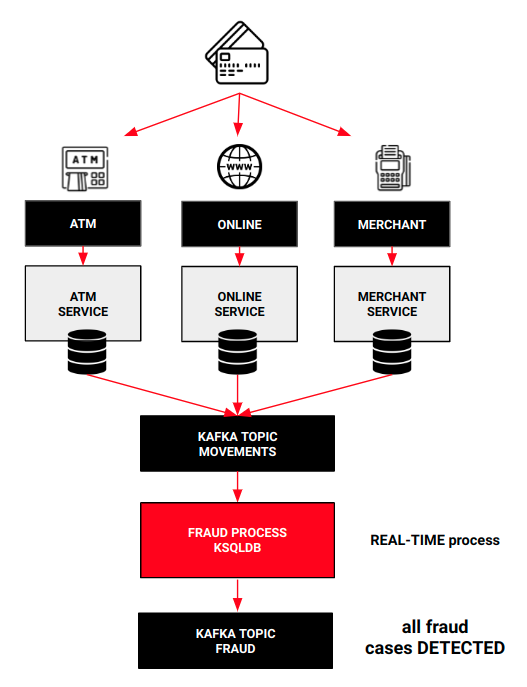
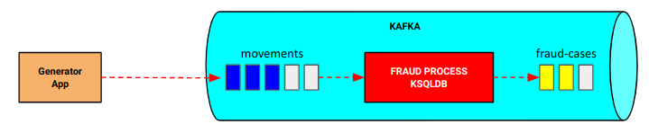
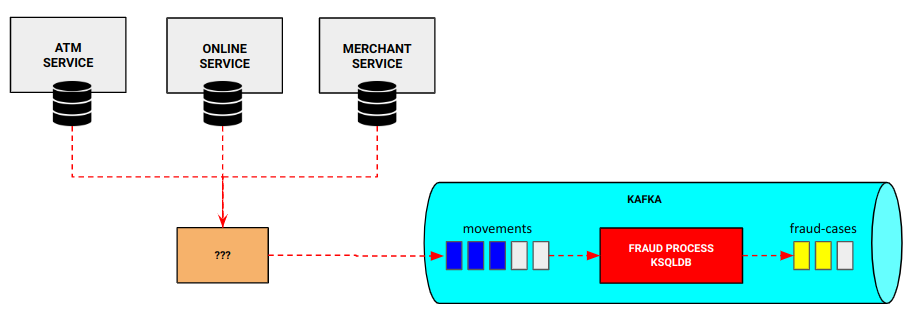
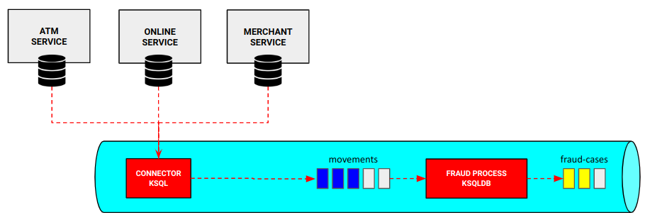
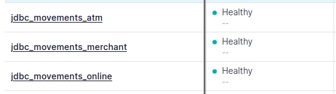
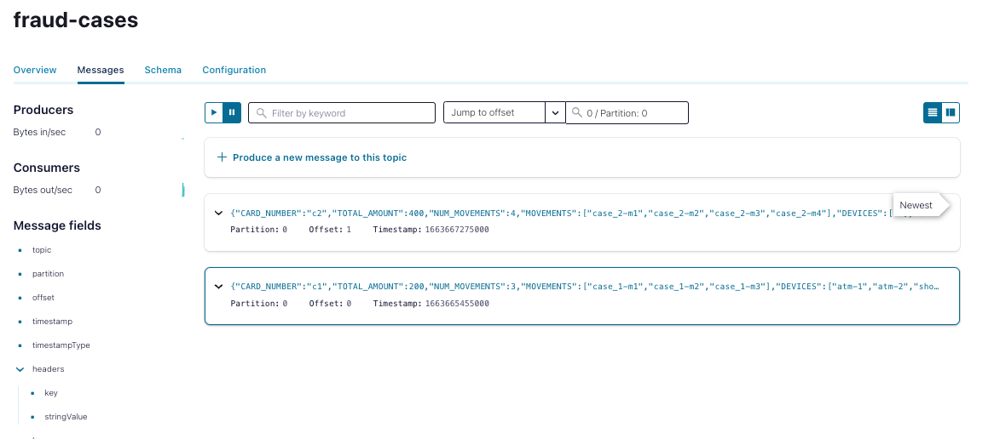

# Fraud Checker Project


This project defines how use ksqlDB to implements a Confluent connector.

For this we are going to modify the [project](https://git.paradigmadigital.com/tecnologia/realtime/streaming-posts/implementations/ksqldb/fraud-checker-ksqldb) where the fraud movements are detected with ksqlDB, modifying the initial process that generated the movements (process in Java)

In this way, we are going to see the other part of the power of ksqlDB, the possibility of integrating with other systems (source and sink). If you want to learn more about it, please visit its documentation: https://ksqldb.io/ .

##### Requeriments

- Docker (to build the associated infrastructure, Confluent platform and its components)


## The use case

In the original project, there is a ksqlDB process that is in charge of detecting fraud from card movements.



Because the important part of the solution is in the fraud process, not attached importance on how to send the data from their respective warehouses to Kafka in order to apply the process.

In this case, it was decided to create an independent process that would simulate the sending of that information.



But, how can you read the movements of different data warehouses in real time as the movements are taking place and are registered in the system? (closer to reality)


## The solution: Confluent Connector & ksqlDB

To create the expected solution, we have to see what options we have to replicate the movement information in real time.



To achieve our desire, for example, we could deploy a CDC tool in order to publish in real time (or near real time) every change in movements sources to an event bus like Kafka.

In this case, we are going to use the Confluent ecosystem to develop our own connector that allows us to perform this functionality. 

We have seen this part many times, such as implementing a connector in Kafka Connect using its API or from Kafka's Confluent Control Center, but with ksqlDB another possibility opens up. Then, how do we create the connector? Well, ksqlDB also allows us to create connectors in a simple way.





## How is structured this repo?

In this repo you'll find these folders:

- **apps**: it contains a ksqlDB scripts and test
  - **ksqldb scripts**: contains ksqldb scripts to detect fraud cases and to create a source connector
  - **db**: contains db data to simulate card movements
  - **Tester**: necessary files to test the ksqldb scripts with [ksql-test-runner](https://docs.ksqldb.io/en/latest/how-to-guides/test-an-app/) tool
- **platform**: it contains the *docker-compose* file to launch a demo environment to really understand how all the components works and fraud cases are detected. The platform is composed of:
  - Zookeeper
  - Kafka
  - Control Center
  - KsqlDB Server
  - Kafka Connect
  - Schema Registry
  - Postgres
  - Adminer
- **demo**: this folder contains the necessary scripts to execute the demo
  - *init.sh*: this script builds the docker images and launch the different docker containers
  - *stop.sh*: this scripts destroy the environment.
- **doc**: this folder only contains document assets


## Executing the demo

Executing the demo is very easy. As we've seen in the previous section, there are some scripts to help us to execute all the necessary taks.

The first step is going to demo folder because all the scripts are going to be executed from there:

```bash
cd demo
```

Once in the demo folder, we have to execute the script creating and initializing the environment. To do that, just write:

```bash
sh init.sh
```

When the script ends, we'll see something like this:

```bash
[+] Running 11/11
 ⠿ Container zookeeper                Running
 ⠿ Container broker                   Healthy
 ⠿ Container connect                  Started
 ⠿ Container ksqldb-server            Started
 ⠿ Container init                     Started
 ⠿ Container schema-registry          Healthy
 ⠿ Container ksqldb-cli               Started
 ⠿ Container control-center           Started
 ⠿ Container rest-proxy               Started
 ⠿ Container ksql-datagen             Started
 ⠿ Container postgres                 Started
 ⠿ Container adminer                  Started
 
 ...

Completed
Platform ready!
```

Unlike the original project, we are not going to create an application that generates movements. In this case, the movements will be inserted in the database after the platform is ready to simulate a real case.


One the platform is ready, we are going to implement the ksqlDB connector manually so that it allows us to read the movements (postgres) and send them to the Kafka topics (movements for each table)

First, let's connect to the ksqlDB-cli client

```bash
docker exec -it ksqldb-cli ksql http://ksqldb-server:8088
```

Once connected, we launch the sentence that will allow us to create a connector so that the information from the database is sent to Kafka in real time (and the information that is generated)

```bash
ksql> RUN SCRIPT /home/appuser/ksqldb_script_connector.sql;
```

If the execution of the sentence has gone well.

```bash
 Message                         
---------------------------------
 Created connector MOVEMENTS_CONNECTOR 
---------------------------------
```

Finally, we simulate the arrival of card movements by inserting records to the data sources.

```bash
 docker exec -i postgres psql -U admin -d cdc -f /datagen.sql

```

In this way, we will already have the element that allows us to publish the required information in Kafka. Once the movements are published, the data will show the following links:

```bash
-------------------------------
Go to Control Center to examine topics: jdbc_movements_table and fraud-cases
Control Center: http://localhost:9021/
-------------------------------
```

Now, if we go to the Confluent [Control Center](http://localhost:9021/) we can check that multiple movements have been published to the topic *** jdbc_movements_*table* ***:



And, the most interesting part, two fraud cases have been detected by KsqlSB. If we examine the fraud-cases topic, we'll see these two cases:



Now, you already have all the tools to play with the process. **Enjoy!**

## How to destroy the environment

Finally, to destroy the environment, we simply have to run the following script:

```bash
sh stop.sh
```


